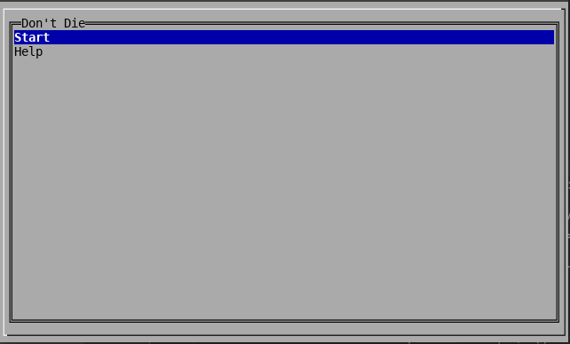
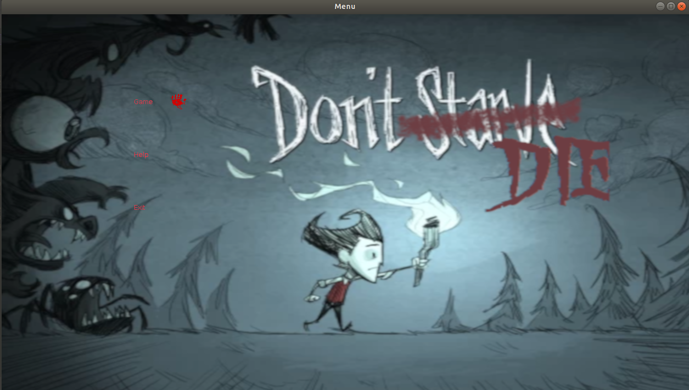

# LPOO_32 Don't Die

2D Survival Game, intended to be a recreation of Don't Starve.
With the purpose of basic survival, the player should try its best
to find resources to survive.

Despite the difficulties of sole survival, it is as well needed to
defend yourself from all the enemies on the map, whose purpose 
is to defeat you.

Developed by [André Rocha](https://github.com/andrefmrocha)
and [Ana Margarida](https://github.com/anamargaridarl)

## Screenshots

    

  
   

    

  
   

