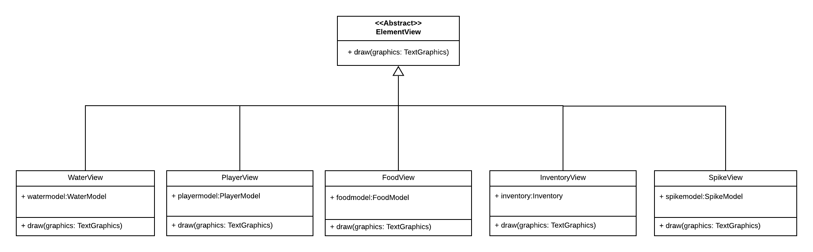
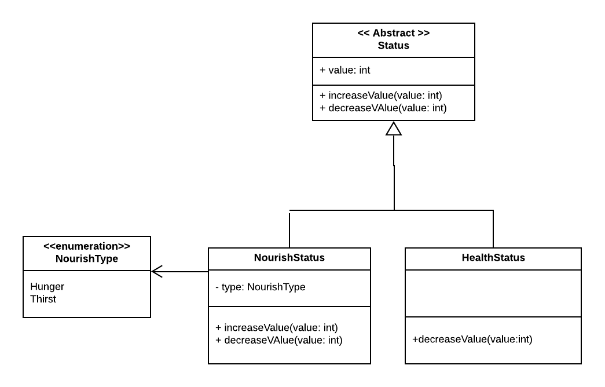

# LPOO_32 Don't Die

2D Survival Game, intended to be a recreation of Don't Starve.
With the purpose of basic survival, the player should try its best
to find resources to survive.

Despite the difficulties of sole survival, it is as well needed to
defend yourself from all the enemies on the map, whose purpose 
is to defeat you.

Developed by [André Rocha](https://github.com/andrefmrocha)
and [Ana Margarida](https://github.com/anamargaridarl)

## Implemented Features

**Move Character -** By pressing the arrow keys your character will move around in the game.

**Consume food or water -** By pressing the T key you can consume food or water from the ground and restore some health value to your main character.

The person has a backpack to store food and water for later use. There are several option to interact with it: 
 
 -  **Collect food and water-** By pressing the F key the character will collect those elements to its own backpack for later use
 -   **Use current element** - By pressing the E key the current element int the backpack will be used and the respective value in will be restored to the character health
 -  **Choose diferent elements**- The current element to use in the backpack will be display on the screen. Use the keys Q and W to switch the current element to use by searching left or right of the backpack.

**Quit game** - By pressing Z the game will return to the main menu.

**Help menu** - By pressing the ? key the game will be redirected to a small menu with all the rules of the game. 

> This section should contain a list of implemented features and their descriptions. In the end of the section, include two or three screenshots that illustrate the most important features.

## Planned Features
To further improve this game we intend to

> This section is similar to the previous one but should list the features that are not yet implemented. Instead of screenshots you should include GUI mock-ups for the planned features.

## Design

### Interactable Element
#### Problem in Context
Most elements had some form of interaction with the Player, whether they
were a weapon that could damage to him, or it was an element he could use
to regain back some health and nourishment. 

There was a need to unify all of them, they may have different requests
and interactions with the Player, however they would all interact 
with him.

#### The Pattern
To solve said issue, we used the **Command** pattern due to several facts:
*  It had the ability to encapsulate our requests (in this case, the interactions);
* It had the ability to parameterize different contextual requests
inside the same class.

### Implementation
With this, we ended up creating and InteractableElement abstract class
that knew its own position, and forced all its children classes to implement
a method to interact with the player. 

    

### Consequences
Now all elements further created that are going to 
have some sort of interaction with the user will be an 
extension of this abstract class, making it so that
they can be grouped together, something that we take 
use of in our program.

### Element Factory
#### Problems in Context
Since our game was of the survival type, there was 
a need to generate different experiences each time
the game was initialized. Therefore there was 
a need to create a way to generate elements for the 
map with an element of randomness. 

Furthermore, there was need to be able to create
element with the prospect of being drawn with 
different graphical interfaces, having the necessity
of abstracting this information from the creation
of the objects.

#### The Pattern
To solve this issue, we used the **Abstract-Factory**
pattern. This pattern is able to give us a 
way of producing objects for related classes, 
without specifying the concrete class.

In our case, it would be able to produce
different kinds of elements to spread
over the map, without the need for it to know
which graphical interface is used.

#### Implementation
Now, there is a factory interface, called ElementFactory which is able to produce an element,
given information on which kind of element it wants
(and their position).

Afterwards, there is an actual implementation of said
factory, called TerminalElementFactory, where an
element is produced to be drawn by a terminal.

Whenever there is a need to use a different graphical
interface, it is only needed to implement
this same factory once again for a different interface. 

    

#### Consequences
Now, each time there is a new element to be added to
the map, there is no need for the use of its
internal constructor since the factory is able to build them.

Moreover, whenever a graphical interface is needed,
it is only needed to create a new implementation
of ElementFactory.

  
### View Element  
#### Problem in Context  
All the elements in the game had a graphic class to draw the information of the object into the screen. Since all shared this feature even though the implementations were different there was a need to unify them all.   
  
#### The Pattern 

To solve said issue, we used the **Command** pattern.     
    
This pattern has the ability to:    
 - Define separate (command) objects that encapsulate a request.    
 - A class delegates a request to a command object  instead of     
implementing a particular request directly.    
    
This enables one to configure a class with a command object that is used to perform a request (drawing into the screen).    
The class is no longer coupled to a particular request and has no knowledge (is independent) of how the request is carried out.  
   
   
### Implementation  
With this, we ended up creating and ElementView abstract class that forced all its children classes to implement  a method to draw their element into the screen .
  
  

  
      

  
  
### Consequences  

Now all elements further created that are going to draw themselves into the screen will be an extension of this abstract class, making it so that  
they can be grouped together, something that we take   
use of in our program.

Additionally we can point several advantages to the use of the command pattern:
-   we are able to decouple the object that invoke the draw function (abstract class) from the one that knows how to perform it (subclasses).
-   It's easy to make changes or add new commands.

### Status  
#### Problem in Context  
The status is a class used to save the value of health, food and water of the character in the game.  
Therefore we need to increase and decrease said values. 
However in the food and water status bars we also need to take into account that it only takes one of these status to reach zero to decrease systematically the value of health of the character based on a time lapse until the values are restored. 

Moreover, whenever the health bar reached zero, it would mean that the player had lost the game.   
  
To do that we need to be able to change in run time the behavior of those functions, as well as have different sorts of behaviors
depending on the client.
   
  
#### The Pattern   
To solve this problem we applied the **Strategy** pattern.  
The use of this pattern allows us to:  
  
 - have multiple implementations (algorithms) for a given feature;   
 - change the algorithm at runtime depending on parameter type.   
    
Those were exactly the features we were looking for to solve this issue.  
   
   
### Implementation  
To implement this pattern we ended up creating a class NourishStatus that extends Status class to implement the functions for the food and water status bars, as well as another for the
health status. 

That way, we can associate different behaviours for each type of
bar (client). 
  
 
  
       
 
  
   
### Consequences  
Now we are able to provide different implementation of behavior to the functions decrease and increase the value in the water/food status bar so as to when it value reaches zero the health will be decremented to the character until it succeeds in using more food or water. 

Furthermore with these design pattern the behavior can be changed without breaking the classes that use it, and the classes can switch between behaviors by changing the specific implementation used without requiring any significant code changes.

> This section should be organized in different subsections, each describing a different design problem that you had to solve during the project. Each subsection should be organized in four different parts: "Problem in Context", "The Pattern", "Implementation" and "Consequences".

## Known Code Smells and Refactoring Suggestions

> This section should describe 3 to 5 different code smells that you have identified in your current implementation, and suggest ways in which the code could be refactored to eliminate them. Each smell and refactoring suggestions should be described in its own subsection.

## Testing Results

> This section should contain screenshots of the main results of both the test coverage and mutation testing reports. It should also contain links to those reports in HTML format (you can copy the reports to the docs folder).

## Self-evaluation

> In this section describe how the work regarding the project was divided between the students. In the event that members of the group do not agree on a work distribution, the group should send an email to the teacher explaining the disagreement.
