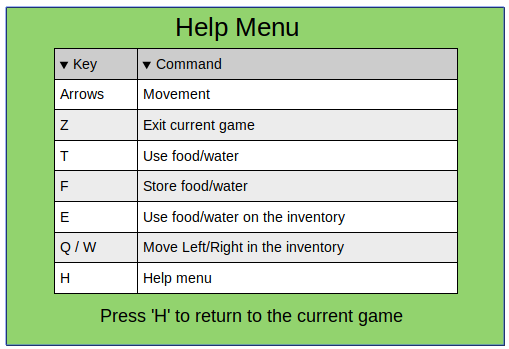
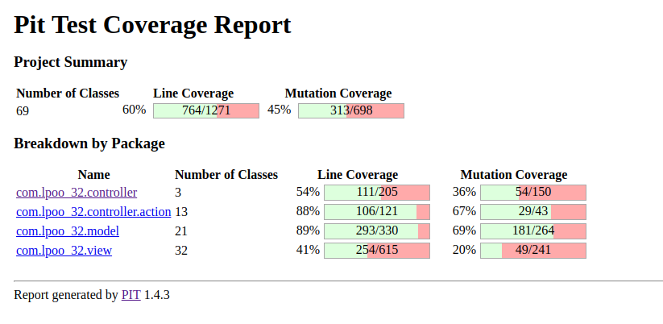

# LPOO_32 Don't Die

2D Survival Game, intended to be a recreation of Don't Starve.
With the purpose of basic survival, the player should try its best
to find resources to survive.

Despite the difficulties of sole survival, it is as well needed to
defend yourself from all the enemies on the map, whose purpose 
is to defeat you.

Developed by [André Rocha](https://github.com/andrefmrocha)
and [Ana Margarida](https://github.com/anamargaridarl)

## Implemented Features

### Menu
The program opens in a menu that allows the user to choose between two options using the arrow up and down keys. Its possible to opt by **starting the game** or go to a **help menu** where all the instructions of the game are on display to see.

To exit the program or to go back to the main menu from the help option the user should press the Q key.
### Game  
  
In the game there are many features implemented to interact with the game.  
   
**Move Character -** By pressing the arrow keys your character will move around in the game. 
    
**Consume food or water -** By pressing the T key you can consume food or water from the ground and restore some health value to your main character.    
  
**Spikes -** When the player passes on top of spikes the character will lose health.  
    
The character has a backpack to store food and water for later use. There are several option to interact with it:     
     
 -  **Collect food and water-** By pressing the F key the character will collect those elements to its own backpack for later use    
 -   **Use current element** - By pressing the E key the current element int the backpack will be used and the respective value in will be restored to the character health    
 -  **Choose diferent elements**- The current element to use in the backpack will be display on the screen. Use the keys Q and W to switch the current element to use by searching left or right of the backpack.    
   
**Quit game** - By pressing Z the game will return to the main menu.   

  **Map -**  The game has a bigger map than what is seen each time on the screen. This means that when the player reaches the limits of the board it will change to the next part of the map and will be allocated to the spot it was trying to access. 
   
  
Furthermore when the water or food values of the character reach 0 the health will start to the decrease continually until those levels are restored to a higher value.  
~~Additionally the health value will decrease after a long period of time without~~   
  
The game is lost when the character health value reaches 0.

    

  
   

> This section should contain a list of implemented features and their descriptions. In the end of the section, include two or three screenshots that illustrate the most important features.

## Architectural Pattern

To structure this project we decided to implement the **MVC (Model-View-Controller)** architectural pattern. 
As the name implies this pattern divides the structure of the program in three interconnected parts:

 - **Model:** It holds the internal game information, rules and is independent of the user interface
 - **View:** Represents the visualization of the data that model contains.
- **Controller:** Exists between the view and the model. It listens to events triggered by the view and executes the appropriate reaction to these events. In most cases, the reaction will change the model and its display
  under view.

The biggest advantage in the MVC architectural pattern is that it decouples these major components allowing for efficient code reuse and parallel development.

## Planned Features  

We intend to add several improvements to the project until the next delivery. Below, there are some example features.

### **Monsters**

We intend to add monsters that move around and take the player's life every time they come into contact with it. 
For that we intend to implement threads on our game. Each monster will be associated to a thread that updates the monster's movement based on a time gap.
The monster will be divided in two class similarly to other elements in the game: 
- one class holds the information of the monsters like their position and the amount of health they can take to the player - **MonsterModel** -  and implements the ElementModel interface;
-  another class draws the monster on the screen -  **MonsterView** -  and implements the Element View interface as well as following the command pattern implemented for the draw function.

### **Buildings**

We also plan to add building in our game. These elements will serve as a hiding spot. This way the player will be able to enter the building and protect himself from the monsters in the scene.

    

### **Game Over**

We'll add a "Game Over" screen whenever the player looses the game. The screen will be built into a class in the graphic part of the game - **GameOver** .

    

### **Help Screen**

We want to add a screen that shows all the game instructions and options so the player can consult it in the middle of the game. That way the game will pause and the screen will be shown. Furthermore by pressing the same key that opened this help menu the player can return to the game.
Just like the "game over" screen we'll built into a class in the graphic part of the game - **HelpView**.

    

### **Other improvements**

We also aim to add some changes to the already existing elements of the game. 
For start the each of the Interactable Elements will be divided in smaller categories and each will have different values associated with.
 - the food will be divided in different elements like **meat**, **vegetables** and **fruit**;
 - the water will be divided into **water** and **milk**;
 - the spikes will be divided into **rocks** and **lava**;
 
 

     
 

### **Graphic ambient**

We'll intend to do the necessary modifications to include the new graphical ambient **Swing** so we can develop a better graphic design.

> This section is similar to the previous one but should list the features that are not yet implemented. Instead of screenshots you should include GUI mock-ups for the planned features.

## Design

### Interactable Element
#### Problem in Context
Most elements had some form of interaction with the Player, whether they
were a weapon that could damage to him, or it was an element he could use
to regain back some health and nourishment. 

There was a need to unify all of them, they may have different requests
and interactions with the Player, however they would all interact 
with him.

#### The Pattern
To solve said issue, we used the **Command** pattern due to several facts:
*  It had the ability to encapsulate our requests (in this case, the interactions);
* It had the ability to parameterize different contextual requests
inside the same class.

### Implementation
With this, we ended up creating and InteractableElement abstract class
that knew its own position, and forced all its children classes to implement
a method to interact with the player. 

    

### Consequences
Now all elements further created that are going to 
have some sort of interaction with the user will be an 
extension of this abstract class, making it so that
they can be grouped together, something that we take 
use of in our program.

### Element Factory
#### Problems in Context
Since our game was of the survival type, there was 
a need to generate different experiences each time
the game was initialized. Therefore there was 
a need to create a way to generate elements for the 
map with an element of randomness. 

Furthermore, there was need to be able to create
element with the prospect of being drawn with 
different graphical interfaces, having the necessity
of abstracting this information from the creation
of the objects.

#### The Pattern
To solve this issue, we used the **Abstract-Factory**
pattern. This pattern is able to give us a 
way of producing objects for related classes, 
without specifying the concrete class.

In our case, it would be able to produce
different kinds of elements to spread
over the map, without the need for it to know
which graphical interface is used.

#### Implementation
Now, there is a factory interface, called ElementFactory which is able to produce an element,
given information on which kind of element it wants
(and their position).

Afterwards, there is an actual implementation of said
factory, called TerminalElementFactory, where an
element is produced to be drawn by a terminal.

Whenever there is a need to use a different graphical
interface, it is only needed to implement
this same factory once again for a different interface. 

    

#### Consequences
Now, each time there is a new element to be added to
the map, there is no need for the use of its
internal constructor since the factory is able to build them.

Moreover, whenever a graphical interface is needed,
it is only needed to create a new implementation
of ElementFactory.

  
### View Element  
#### Problem in Context  
All the elements in the game had a graphic class to draw the information of the object into the screen. Since all shared this feature even though the implementations were different there was a need to unify them all.   
  
#### The Pattern 

To solve said issue, we used the **Command** pattern.     
    
This pattern has the ability to:    
 - Define separate (command) objects that encapsulate a request.    
 - A class delegates a request to a command object  instead of     
implementing a particular request directly.    
    
This enables one to configure a class with a command object that is used to perform a request (drawing into the screen).    
The class is no longer coupled to a particular request and has no knowledge (is independent) of how the request is carried out.  
   
   
### Implementation  
With this, we ended up creating and ElementView abstract class that forced all its children classes to implement  a method to draw their element into the screen .
  
  

  
      

  
  
### Consequences  

Now all elements further created that are going to draw themselves into the screen will be an extension of this abstract class, making it so that  
they can be grouped together, something that we take   
use of in our program.

Additionally we can point several advantages to the use of the command pattern:
-   we are able to decouple the object that invoke the draw function (abstract class) from the one that knows how to perform it (subclasses).
-   It's easy to make changes or add new commands.

### Status 
#### Problem in Context 
The status is a class used to save the value of health, food and water of the character in the game.    
Therefore we need to increase and decrease said values.   
However in the food and water status bars we also need to take into account that it only takes one of these status to reach zero to decrease systematically the value of health of the character based on a time lapse until the values are restored.   
  
Moreover, whenever the health bar reached zero, it would mean that the player had lost the game.     
    
To do that we need to be able to change in run time the behavior of those functions, as well as have different sorts of behaviors  
depending on the client.  
     
    
#### The Pattern
 To solve this problem we applied the **Strategy** pattern.    
The use of this pattern allows us to:    
    
 - have multiple implementations (algorithms) for a given feature;     
 - change the algorithm at runtime depending on parameter type.     
      
Those were exactly the features we were looking for to solve this issue.    
     
     
#### Implementation 
To implement this pattern we ended up creating a class NourishStatus that extends Status class to implement the functions for the food and water status bars, as well as another for the health status.   
  
That way, we can associate different behaviours for each type of  
bar (client).   
    
 
    
         
 
    
     
#### Consequences 
Now we are able to provide different implementation of behavior to the functions decrease and increase. This way in the water/food status bar when the value reaches zero the health will be decremented to the character until it succeeds in using more food or water and in the health bar the game will be lost.
  
Furthermore with these design pattern the behavior can be changed without breaking the classes that use it, and the classes can switch between behaviors by changing the specific implementation used without requiring any significant code changes.
> This section should be organized in different subsections, each describing a different design problem that you had to solve during the project. Each subsection should be organized in four different parts: "Problem in Context", "The Pattern", "Implementation" and "Consequences".

## Known Code Smells and Refactoring Suggestions

### Long Method
#### Problem
The class TerminalKeyboard processing of a specific key is indeed 
what is considered a very long method. Even if the 
switch statement could be also be seen as an **OOP  Abuser**, it 
would be impossible to interpret the keyboard without using such
a design.

#### Solution
Due to its necessity to parse which key has been pressed,
it is unfortunately necessary to maintain some of its length.
 
Notwithstanding, it is still possible to use the **Extract Inline Method**, to take off 
some of its length, more specifically, extracting the zone where a character
is parsed, which is a nested switch inside another switch.

### Data Class

#### Problem
Our current Elements class is a class which only purpose is to provide a better interface
in order to access its data. It applies absolutely no internal logic as of right now.

#### Solution
Due to its nature of storing elements in their positions, in due time, this class
shall implement some logic, more specifically with elements in duplicate positions,
which will be one of our short-term concerns.

### Shotgun Surgery
#### Problem
The current Game has a method of displaying that is dependent on
a current value assigned to movement. At the time of writing of this report,
each player movement is equivalent to a movement of 4% of the screen. 

If, for some reason, there was the need to change this value, it would result in changes
to **several** classes: Game, Position, GameController, etc.

#### Solution
The **Extract Variable** method should be used in order to make this more efficient,
being that the one who controls this information, should pass it down to all the other
classes, being that a change is only needed to be done in one place for it ripple onto 
all other classes.

### Middle Man
#### Problem
The class KeyTable only serves as an access point to help us 
insert more easily information onto our Table from the **lanterna**
framework. It does no sort of logic at all.

#### Solution
To remove such a class, whose needs is not that big, and substitute
it with a method inside the Menu class. Since its purpose its only
to provide more readability into the code, there's no need for
it to be decoupled into a different class.
> This section should describe 3 to 5 different code smells that you have identified in your current implementation, and suggest ways in which the code could be refactored to eliminate them. Each smell and refactoring suggestions should be described in its own subsection.

## Testing Results

  
   

If you'd like to read more about our tests, [click here](https://lpoo-32-test-report.surge.sh/)

If you'd like to read more about our mutation tests, [click here](https://lpoo-32-pitest-report.surge.sh/)

> This section should contain screenshots of the main results of both the test coverage and mutation testing reports. It should also contain links to those reports in HTML format (you can copy the reports to the docs folder).

## Self-evaluation

Ana Margarida: 

André Rocha: 

> In this section describe how the work regarding the project was divided between the students. In the event that members of the group do not agree on a work distribution, the group should send an email to the teacher explaining the disagreement.
