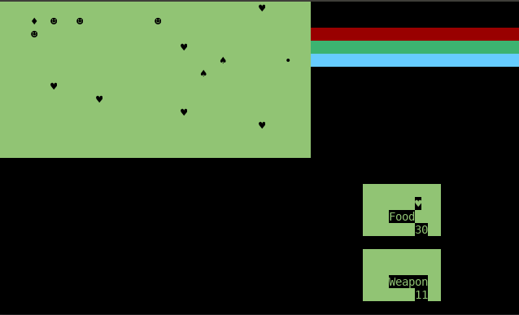
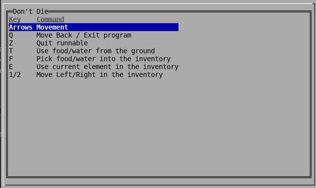
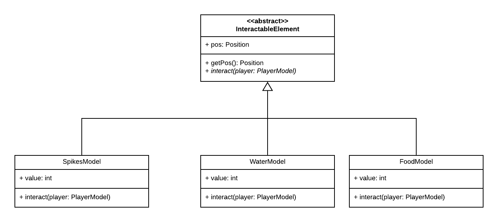

# LPOO_32 Don't Die

2D Survival Game, intended to be a recreation of Don't Starve.
With the purpose of basic survival, the player should try its best
to find resources to survive.

Despite the difficulties of sole survival, it is as well needed to
defend yourself from all the enemies on the map, whose purpose 
is to defeat you.

Developed by [André Rocha](https://github.com/andrefmrocha)
and [Ana Loureiro](https://github.com/anamargaridarl)

## Implemented Features    
 ### Menu 
 The program opens in a menu that allows the user to choose between two options using the arrow up and down keys. Its possible to opt by **starting the game** or go to a **help menu** where all the instructions of the game are on display to see.    
    
To exit the program or to go back to the main menu from the help option the user should press the Q key.    
### Game      
 In the game there are many features implemented to interact with the game.      
       
**Move Character -** By pressing the arrow keys your character will move around in the game.     
        
**Consume food or water -** By pressing the T key you can consume food or water from the ground and restore some health value to your main character.        

**Grab weapon** - By pressing the T key you can also grab an weapon from the ground and put it directly in use by the player. 
      
**Spikes -** When the player passes on top of spikes the character will lose health.      
        
The character has a backpack to store food , water and weapons for later use. There are several option to interact with it:         
         
 -  **Collect food , water or weapons -** By pressing the F key the character will collect those elements to its own backpack for later use        
 -   **Use current element** - By pressing the E key the current element int the backpack will be used. 
	 -	Regarding the provisions stored their use will restore to the character health and hunger or thirst. 
	 -	In case of the weapons it will set it as the weapon on use by the player. That means that in case the player already had a weapon on use it will be stored in the backpack and switched by the chosen.
	    
 -  **Choose different elements**- The current element to use in the backpack will be display on the screen. Use the keys 1 and 2 to switch the current element to use by searching left or right of the backpack.        
 
   **Fight monsters**- The player can attack the monsters according to their orientation.This way by using the keys A(left), W(up), S(down), D(right) he can attack the monsters that are directly on his sides.
 
 
   **Shelter in house**- The game map will create a house on a random position for the player to shelter. By entering by the door he will be protected from the monsters. 
 - **Sleep -** Additionally, this house has a bed that allows the player to recover from it's adventure. To do so the player needs to walk to the side of the bed so its health levels increase. On the down side, it will wake up feelling more thirsty and hungry since those values will be decreased.
	 
**Quit game** - By pressing Z the game will return to the main menu.       

**Graphical Interface -**  The game can be run with Lanterna or Swing

 Its also fundamental to explain the logic behind some features and elements in the game:    
    
**Map -** The game has a bigger map than what is seen each time on the screen. This means that when the player reaches the limits of the board it will change to the next part of the map and will be allocated to the spot it was trying to access.     
       
**Monsters -** These creatures will follow the player in their respective part of the map. When they reach the player they will attack and decrease his life.

**Life values -** When the water or food values of the character reach 0 the health will start to the decrease continually until those levels are restored to a higher value.      
Additionally the health value will cyclically decrease by a time frame.  
      
**Game Over-** The game is lost when the character health value reaches 0.

The features created in the second part of this project were: **Monsters**, **Meapons**, **Buildings** and the **Swing** Graphical interface.

    

  
   

## Architectural Pattern

To structure this project we decided to implement the **MVC (Model-View-Controller)** architectural pattern. 
As the name implies this pattern divides the structure of the program in three interconnected parts:

 - **Model:** It holds the internal game information, rules and is independent of the user interface
 - **View:** Represents the visualization of the data that model contains.
- **Controller:** Exists between the view and the model. It listens to events triggered by the view and executes the appropriate reaction to these events. In most cases, the reaction will change the model and its display
  under view.

The biggest advantage in the MVC architectural pattern is that it decouples these major components allowing for efficient code reuse and parallel development.

## Design

### Interactable Element
#### Problem in Context
Most elements had some form of interaction with the Player, whether they
were a weapon that could damage to him, or it was an element he could use
to regain back some health and nourishment. 

There was a need to unify all of them, they may have different requests
and interactions with the Player, however they would all interact 
with him.

#### The Pattern
To solve said issue, we used the **Command** pattern due to several facts:
*  It had the ability to encapsulate our requests (in this case, the interactions);
* It had the ability to parameterize different contextual requests
inside the same class.

### Implementation
With this, we ended up creating and InteractableElement abstract class
that knew its own position, and forced all its children classes to implement
a method to interact with the player. 

    

### Consequences
Now all elements further created that are going to 
have some sort of interaction with the user will be an 
extension of this abstract class, making it so that
they can be grouped together, something that we take 
use of in our program.

### Element Factory
#### Problems in Context
Since our game was of the survival type, there was 
a need to generate different experiences each time
the game was initialized. Therefore there was 
a need to create a way to generate elements for the 
map with an element of randomness. 

#### The Pattern
To solve this issue, we used the **Factory**
pattern. This pattern is able to give us a 
way of producing objects for related classes, 
without specifying the concrete class.

In our case, it would be able to produce
different kinds of elements to spread
over the map easily without having to specifically
instatiate said classes.

#### Implementation
Now, there is a factory, called ElementFactory which is able to produce an element,
given information on which kind of element it wants
(and their position).

    

#### Consequences
Now, each time there is a new element to be added to
the map, there is no need for the use of its
internal constructor since the factory is able to build them.

### Status 
#### Problem in Context 
The status is a class used to save the value of health, food and water of the character in the game.    
Therefore we need to increase and decrease said values.   
However in the food and water status bars we also need to take into account that it only takes one of these status to reach zero to decrease systematically the value of health of the character based on a time lapse until the values are restored.   
  
Moreover, whenever the health bar reached zero, it would mean that the player had lost the game.     
    
To do that we need to be able to change in run time the behavior of those functions, as well as have different sorts of behaviors  
depending on the client.  
     
    
#### The Pattern
 To solve this problem we applied the **Strategy** pattern.    
The use of this pattern allows us to:    
    
 - have multiple implementations (algorithms) for a given feature;     
 - change the algorithm at runtime depending on parameter type.     
      
Those were exactly the features we were looking for to solve this issue.    
     
     
#### Implementation 
To implement this pattern we ended up creating a class NourishStatus that extends Status class to implement the functions for the food and water status bars, as well as another for the health status.   
  
That way, we can associate different behaviours for each type of  
bar (client).   
    
 
    
         
 
    
     
#### Consequences 
Now we are able to provide different implementation of behavior to the functions decrease and increase. This way in the water/food status bar when the value reaches zero the health will be decremented to the character until it succeeds in using more food or water and in the health bar the game will be lost.
  
Furthermore with these design pattern the behavior can be changed without breaking the classes that use it, and the classes can switch between behaviors by changing the specific implementation used without requiring any significant code changes.

### GameSwing
#### Problem in Context
Drawing in the Swing framework is a very different
process than it is using the Lantern framework.
This proved to be a problem, when the purpose was
to unify them all under a single controller.

We needed a way to adapt Swing's interface into lanterna's, as a means to unify both of them.

#### The Pattern
To solve this issues we used a **Adapter** pattern. This
pattern was exactly created with the purpose we needed:
- To convert the interface of a class into another 
interface that the client expects (in this case, the controller).

With this, we were able to unify both Swing and Lanterna
under the same interface **Game**.

#### Implementation
To solve this issue, we implement the class GameSwing, 
whose objective was to adapt how Swing works, so that 
it would do something similar to lanterna, or that, at
least, it would update the screen when the method 
draw was called.

 
    
         
 

 #### Consequences
 From this pattern, we were to obtain an interface that
 worked similar to Lanterna's, with the ability to update
 itself graphically, as needed by the current implementation
 of the Controller.

 With this, we were able to parameterize both Lanterna 
 and Swing to draw exactly the same way.

### TerminalKeyboard
#### Problem in Context
Both Lanterna and Swing worked very much differently
from one another in terms of how they used the keyboard.
Lanterna forces to you read they keyboard yourself
and to interpret it in runtime, whereas Swing used an 
**Observer** Pattern (called Listener in its implementation)
in order to read the Keyboard. Therefore, both interfaces
were once again incompatible.

#### Solution
To solve this incompatibility, it was used an implemented an **Observer** Pattern. The observer, allowed us to convert the interface used by
Lanterna, into something similar to Swing's interface.
Therefore, it started working as Swing's Keyboard Listener.

#### Implementation
Therefore, our GameController became an observer
for updates coming from the keyboard, even in lanterna's eyes.
Due to how Lanterna's read input works, it was also needed
to use a **multi-threading** approach to the issue.
 
    
         
 

#### Consequences
Consequently, Lanterna's and Swing Keyboard now both 
worked through Observers, which meant it was easy to 
unify them in the same GameController.
From now on, though, all other views to be implemented
would need to have the keyboard read through some 
sort of observer as well. This, even though it is clearly
a limitation, is not very much problematic, since most
frameworks do work with Observers for the keyboard.

### Action
#### Problem in Context
Before, the implementation of several different 
actions on the GameController were defined
by a switch case, which had clear switch statement
code smell.

In order to make all actions work together, there was a
need to parameterize their requests into a single action.

#### Solution
To solve this need for parametization, we used an **Command** pattern. Its main focus is indeed to 
be to parameterize clients with different requests, which
are indeed our actions.

This way, we are able to process different sorts of requests
related to the keyboard without the need for a long method
with a huge switch statement.

#### Implementation
Now, all keyboard keys of interest have an action associated
(a command), with the ability to execute an action
related to the state of the game.
 
    
         
 

#### Consequences
 It was now possible to separate several lines of code into a much testable framework, where every action 
 was its own class, and, at the same time, reduce the
 size of a once very long method.
 
###  Move Monsters
 #### Problem in Context  
 The monsters required to move based on a time frame different from the one used to update the game. 
 In order to implement this feature the monster's graphical component needed to interact with it logical component so that when the draw of the graphical component occurs , it notifies the model component that moves the element when a certain condition occurs.
   
 #### The Pattern  
 To solve said issue, we used the **Observer** pattern due to:  
 -   The abstraction has two aspects that dependent one on the other since the graphical component needs to logical component modifications to draw the changes of the movement and on the opposite side the logical component depends on the last to know when to update its movement.
 
   
 #### Implementation  
 With this, we ended up creating a function in the Monster Model that is updated every time the monster is drawn and a variable is incremented. This way when the variable reaches a certain number this function implements the movement in the monster with the necessary constraints to it.
 
 
    
         
 

 
 #### Consequences
 With the application of this pattern we are able to update the monster movement to the rate we intend to. 
Furthermore, in a more theoretical approach we are able to create abstract coupling between subject and observer.

 ### Nourish State
#### Problem in Context  
We need have different behaviors to update the different life parameters (health, hunger and thirst) based on different states of the player. This means that we need different implementations based on different states
  
#### The Pattern  
To solve said issue, we used the **State** pattern due to:  
-   an object behavior depends on its state, and it must change that state in run-time.
-  state-specific behavior is defined independently thus adding new states doesn't affect the behavior of existing states.
  
#### Implementation  
We ended up creating and NourishState abstract class where it children  handle different behaviors and though representing different states.

 
    
         
 

#### Consequences
 It is now possible to modify the behaviour of the game when its internal state changes as well as
 separate the several behaviours into independent states that don't affect any other existing states or any new to implement later on. 

### MenuAbstractFactory
#### Problem in Context
Since both games run on different menus with 
very much different graphical interfaces and different
necessities, there was a necessity to be able
abstract this information from the Application
level of it. Furthermore, if any framework needed
some more information, this would create further
incompatibilities which would need to solved
by changing the Application itself.

#### The Pattern
In order to solve this issue, we use an **Abstract-Factory**
design pattern which is able to provide us a solution to our problem. 
An Abstract-Factory is able to provide an interface
for families of related objects, which is exactly
what I was trying to provide here.

#### Implementation
Therefore, it was defined an interface to provide
menus (and anything else it was futurely needed).
 
    
         
 

#### Consequences
Thus, with this Abstract-Factory, it is now able to 
perfectly abstract any necessity in terms of
Graphical Interface dependencies from itself,
therefore being able to provide a safer and more 
testable way of getting this information,
then having to change already written and tested
code.
 

## Known Code Smells and Refactoring Suggestions

### Long Method
#### Problem
The class TerminalKeyboard processing of a specific key is indeed 
what is considered a very long method. Even if the 
switch statement could be also be seen as an **OOP  Abuser**, it 
would be impossible to interpret the keyboard without using such
a design.

#### Solution
Due to its necessity to parse which key has been pressed,
it is unfortunately necessary to maintain some of its length.
 
Notwithstanding, it is still possible to use the **Extract Inline Method**, to take off 
some of its length, more specifically, extracting the zone where a character
is parsed, which is a nested switch inside another switch.

### Shotgun Surgery
#### Problem
The current Game has a method of displaying that is dependent on
a current value assigned to movement. At the time of writing of this report,
each player movement is equivalent to a movement of 4% of the screen. 

If, for some reason, there was the need to change this value, it would result in changes
to **several** classes: Game, Position, GameController, etc.

#### Solution
The **Extract Variable** method should be used in order to make this more efficient,
being that the one who controls this information, should pass it down to all the other
classes, being that a change is only needed to be done in one place for it ripple onto 
all other classes.

### Middle Man
#### Problem
The class KeyTable only serves as an access point to help us 
insert more easily information onto our Table from the **lanterna**
framework. It does no sort of logic at all.

#### Solution
To remove such a class, whose needs is not that big, and substitute
it with a method inside the Menu class. Since its purpose its only
to provide more readability into the code, there's no need for
it to be decoupled into a different class.

### Duplicate Code
#### Problem
Some of the Action Events are very similar to each other, being that 
they only change some very little details (due to being related) to
movements in different directions. It is a clear example of code that 
very much similar.

#### Solution
It would be wise to group these classes into an upper abstract class,
where some of the logic would be implemented, in order to prevent any
issues, specially when change is needed, since it would be necessary 
to implement said changes in every single class.

### Switch Statements
#### Problem
In the class MonsterModel, when the information is changed regarding their movement,
there's a big switch with a lot of logic implemented, which also has a lot of **duplicate code**.

This is of course a problem, since a slight change, implied changing all different cases,
as well as the addition of a new case, would also mean having to interfere with already written 
and tested code.

#### Solution
It would be better to parametrize every request under a **command** pattern, where 
all information would derive from the same abstract class, since most code is pratically,
the same, besides a few of the method calls.

### Middle Man
#### Problem 
The class MovableElement only purpose is to couple a model with its name,
which is undoubtedly unnecessary, since its only purpose is to call methods
of other classes.

### Solution
Since its necessity is so low, the class itself should cease existing, as there is no
need to couple things even further, which can only produce further bugs down
the line, with the increase of features.

## Testing Results

  
   

If you'd like to read more about our tests, [click here](https://lpoo-32-test-report.surge.sh/)

If you'd like to read more about our mutation tests, [click here](https://lpoo-32-pitest-report.surge.sh/)

## Self-evaluation
The following enumeration of the features developed by each
of the students is not a favorable metric to measure the 
work by each student. Yet as requested:

 - Ana Loureiro (50%): 
    - Catchable Elements
    - Inventory
    - Game Controller
    - Player
    - Interactable Element

 - André Rocha (50%): 
    - Main Menu
    - Health and Nourishment Status Bar
    - Map Movement
    - Help Menu
    - Movable Element
    - ScreenSize

